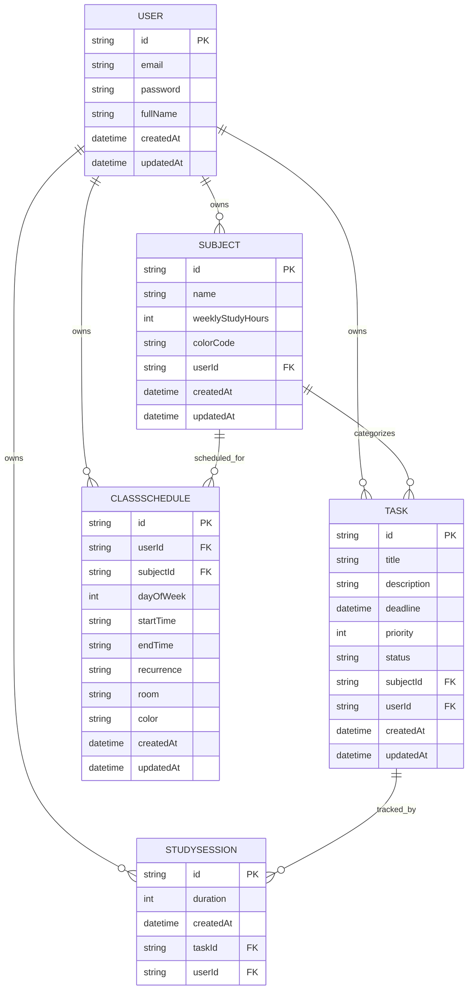

# 📚 Study Planner Backend

Backend API cho **Hệ thống hỗ trợ lập kế hoạch học tập cho sinh viên** (Study Planner), được xây dựng bằng Node.js, Express và Prisma ORM trên nền PostgreSQL.
---

## 📑 Mục lục

- [Features](#-features)
- [Tech Stack](#-tech-stack)
- [Project Structure](#-project-structure)
- [Installation](#-installation)
- [Environment Variables](#-environment-variables)
- [Database](#-database)
- [API Documentation](#-api-documentation)
- [Authentication](#-authentication)
- [Request Flow](#-request-flow)
- [Error Handling](#-error-handling)
- [Security](#-security)
- [Available Scripts](#-available-scripts)
---

## ✨ Features

Danh sách chức năng được suy ra trực tiếp từ các controller và route thực tế trong mã nguồn:

- 🔐 **JWT Authentication** – đăng ký, đăng nhập, đổi mật khẩu qua token
- 👤 **User Management** – xóa tài khoản (cascade xóa toàn bộ dữ liệu liên quan)
- 📘 **Subject Management** – CRUD môn học, tính phần trăm tiến độ theo task
- ✅ **Task CRUD** – tạo, sửa, xóa, cập nhật trạng thái (`TODO` → `IN_PROGRESS` → `DONE`)
- 🎯 **Auto Priority Calculation** – tự tính độ ưu tiên task (1/2/3) dựa trên khoảng cách tới deadline
- ⏰ **Cron Job cập nhật Priority** – chạy hằng ngày (`0 0 * * *`) để tự cập nhật priority các task chưa hoàn thành
- 🗓️ **Class Schedule (Thời khóa biểu)** – tạo, xem lịch học hôm nay/toàn bộ, hỗ trợ lặp lại theo tuần chẵn/lẻ (`getCurrentWeekParity`), xóa lịch
- ⏱️ **Study Session Tracking** – lưu thời gian học kiểu Pomodoro, tổng hợp theo tuần và tổng thời gian
- 📊 **Analytics Overview** – thống kê tổng giờ học, task hoàn thành, phân bố môn học, xu hướng hoàn thành task 6 tháng gần nhất, huy hiệu thành tích (achievements)
- 🧪 **Input Validation** – dùng `express-validator` cho luồng auth (register/login/đổi mật khẩu)
- 🗄️ **Prisma ORM** – toàn bộ truy vấn dữ liệu qua Prisma Client
- 🐘 **PostgreSQL** – cơ sở dữ liệu chính (`datasource db { provider = "postgresql" }`)
- 🛡️ **Global Error Handling** – middleware xử lý lỗi tập trung, có xử lý riêng lỗi Prisma `P2002` (trùng lặp dữ liệu)
- 🌐 **CORS & Helmet** – bảo vệ header HTTP và cho phép frontend gọi API

---

## 🛠 Tech Stack

| Technology | Usage |
| ---------- | ----- |
| Node.js | Môi trường chạy backend |
| Express | Web framework, định tuyến API |
| Prisma (`@prisma/client`, `prisma`) | ORM thao tác với PostgreSQL |
| PostgreSQL | Hệ quản trị cơ sở dữ liệu (`datasource db`) |
| JWT (`jsonwebtoken`) | Sinh và xác thực token đăng nhập |
| bcrypt | Hash mật khẩu người dùng |
| express-validator | Kiểm tra dữ liệu đầu vào cho route auth |
| helmet | Thiết lập các HTTP header bảo mật |
| cors | Cho phép truy cập API từ domain khác (frontend) |
| dotenv | Nạp biến môi trường từ file `.env` |
| node-cron | Lập lịch chạy job cập nhật priority tự động |
| nodemon | Tự khởi động lại server khi code thay đổi (dev) |

---

## 🗂 Project Structure

Cây thư mục dưới đây được lấy đúng theo thực tế của thư mục `Server`:

```text
Server/
├── README.md
├── index.js                     
├── package.json
├── package-lock.json
├── prisma.config.ts              
├── server.js                     
├── prisma/
│   ├── schema.prisma              
│   └── migrations/
│       ├── migration_lock.toml
│       └── 20260223060635_init/migration.sql
└── src/
    ├── app.js                     
    ├── config/
    │   └── db.js                  
    ├── controllers/
    │   ├── analytics.controller.js
    │   ├── auth.controller.js
    │   ├── schedule.controller.js
    │   ├── studySession.controller.js
    │   ├── subject.controller.js
    │   ├── task.controller.js
    │   └── user.controller.js
    ├── cron/
    │   └── priorityUpdater.js     
    ├── middlewares/
    │   ├── auth.middleware.js     
    │   └── error.middleware.js    
    ├── routes/
    │   ├── analytics.routes.js
    │   ├── auth.routes.js
    │   ├── schedule.routes.js
    │   ├── studySession.routes.js
    │   ├── subject.routes.js
    │   ├── task.routes.js
    │   └── user.routes.js
    ├── utils/
    │   ├── date.utils.js         
    │   ├── jwt.utils.js           
    │   └── priority.utils.js      
    └── validations/
        └── auth.validator.js      
```


---

## 🚀 Installation


```bash
git clone https://github.com/AnhKietgs/study-planner.git

cd study-planner/Server

npm install

# Tạo file .env (xem mục Environment Variables bên dưới)

# Đẩy schema Prisma lên database
npm run db:push

npm run dev
```

Chạy ở môi trường production:

```bash
npm start
```


---

## 🗄 Database

Được đọc trực tiếp từ `prisma/schema.prisma`.

### Các bảng (models)

- **User** – `id`, `email` (unique), `password`, `fullName`, `createdAt`, `updatedAt`
- **Subject** – `id`, `name`, `weeklyStudyHours` (mặc định 4), `colorCode`, `userId`, `createdAt`, `updatedAt`
- **Task** – `id`, `title`, `description`, `deadline`, `priority` (mặc định 2: 1=High, 2=Medium, 3=Low), `status` (mặc định `"TODO"`), `subjectId`, `userId`, `createdAt`, `updatedAt`
- **StudySession** – `id`, `duration` (số phút), `createdAt`, `taskId`, `userId`
- **ClassSchedule** – `id`, `userId`, `subjectId`, `dayOfWeek`, `startTime`, `endTime`, `recurrence` (mặc định `"EVERY_WEEK"`), `room`, `color`, `createdAt`, `updatedAt`

### Khóa chính & khóa ngoại

- Tất cả các bảng dùng `id` kiểu `String` với `@default(uuid())` làm khóa chính.
- `Subject.userId` → `User.id`, **onDelete: Cascade**
- `Task.userId` → `User.id`, **onDelete: Cascade**
- `Task.subjectId` → `Subject.id`, **onDelete: SetNull** (task không bị xóa khi môn học bị xóa, chỉ mất liên kết)
- `StudySession.taskId` → `Task.id`, **onDelete: Cascade**
- `StudySession.userId` → `User.id`, **onDelete: Cascade**
- `ClassSchedule.userId` → `User.id`, **onDelete: Cascade**
- `ClassSchedule.subjectId` → `Subject.id`, **onDelete: Cascade**


### Sơ đồ ERD



---

## 📡 API Documentation

Tất cả route được gắn tiền tố base path theo `src/app.js`.

### Auth — `/api/v1/auth` (`auth.routes.js` → `auth.controller.js`)

| Method | Endpoint | Description | Authentication |
| ------ | -------- | ----------- | --------------- |
| POST | `/api/v1/auth/register` | Đăng ký tài khoản mới (kiểm tra trùng email, hash mật khẩu bằng bcrypt) | Không |
| POST | `/api/v1/auth/login` | Đăng nhập, trả về JWT token có hạn 7 ngày | Không |
| PUT | `/api/v1/auth/forgot-password` | Đổi mật khẩu (yêu cầu đã đăng nhập, kiểm tra `req.user.id` khớp với tài khoản) | Có (JWT) |

### Subjects — `/api/v1/subjects` (`subject.routes.js` → `subject.controller.js`)

| Method | Endpoint | Description | Authentication |
| ------ | -------- | ----------- | --------------- |
| GET | `/api/v1/subjects/getSubject` | Lấy danh sách môn học kèm % tiến độ (`progress`) | Có (JWT) |
| POST | `/api/v1/subjects/createSubject` | Tạo môn học mới | Có (JWT) |
| PUT | `/api/v1/subjects/updateSubject/:id` | Cập nhật môn học | Có (JWT) |
| DELETE | `/api/v1/subjects/deleteSubject/:id` | Xóa môn học | Có (JWT) |

### Tasks — `/api/v1/tasks` (`task.routes.js` → `task.controller.js`)

| Method | Endpoint | Description | Authentication |
| ------ | -------- | ----------- | --------------- |
| POST | `/api/v1/tasks/createTask` | Tạo công việc, tự tính `priority` qua `calculateAutoPriority` | Có (JWT) |
| PATCH | `/api/v1/tasks/updateStatus/:id` | Cập nhật trạng thái (`TODO`/`IN_PROGRESS`/`DONE`) | Có (JWT) |
| PUT | `/api/v1/tasks/updateTask/:id` | Cập nhật thông tin công việc, tính lại priority | Có (JWT) |
| DELETE | `/api/v1/tasks/deleteTask/:id` | Xóa công việc | Có (JWT) |
| GET | `/api/v1/tasks/getTask` | Lấy danh sách công việc, priority được map thành `HIGH`/`MEDIUM`/`LOW` | Có (JWT) |
| GET | `/api/v1/tasks/weekly-progress` | Tiến độ công việc trong tuần hiện tại (theo số lượng & theo thời gian) | Có (JWT) |

### Users — `/api/v1/users` (`user.routes.js` → `user.controller.js`)

| Method | Endpoint | Description | Authentication |
| ------ | -------- | ----------- | --------------- |
| DELETE | `/api/v1/users/delete` | Xóa tài khoản của chính người dùng (cascade toàn bộ dữ liệu liên quan) | Có (JWT) |

### Study Session — `/api/v1/studySession` (`studySession.routes.js` → `studySession.controller.js`)

| Method | Endpoint | Description | Authentication |
| ------ | -------- | ----------- | --------------- |
| POST | `/api/v1/studySession/saveTime` | Lưu một phiên học (kiểm tra task tồn tại & thuộc user) | Có (JWT) |
| GET | `/api/v1/studySession/weekly-chart` | Dữ liệu biểu đồ thời gian học trong tuần hiện tại | Có (JWT) |
| GET | `/api/v1/studySession/total-time` | Tổng thời gian học (phút & giờ) | Có (JWT) |

### Schedule — `/api/v1/schedule` (`schedule.routes.js` → `schedule.controller.js`)

| Method | Endpoint | Description | Authentication |
| ------ | -------- | ----------- | --------------- |
| POST | `/api/v1/schedule/create` | Tạo lịch học cho nhiều ngày trong tuần cùng lúc (`daysOfWeek`) | Có (JWT) |
| GET | `/api/v1/schedule/today` | Lấy lịch học hôm nay (có tính tuần chẵn/lẻ) | Có (JWT) |
| GET | `/api/v1/schedule/all` | Lấy toàn bộ lịch học | Có (JWT) |
| DELETE | `/api/v1/schedule/:id` | Xóa một lịch học (kiểm tra quyền sở hữu) | Có (JWT) |

### Analytics — `/api/v1/analytics` (`analytics.routes.js` → `analytics.controller.js`)

| Method | Endpoint | Description | Authentication |
| ------ | -------- | ----------- | --------------- |
| GET | `/api/v1/analytics/overview` | Thống kê tổng hợp: tổng giờ học, task, lớp học, biểu đồ tuần, phân bố môn học, xu hướng 6 tháng, huy hiệu thành tích | Có (JWT) |

---

## 🔐 Authentication

- **Register**: kiểm tra email đã tồn tại chưa (`prisma.user.findUnique`), hash mật khẩu bằng `bcrypt.genSalt(10)` + `bcrypt.hash`, lưu user vào database.
- **Login**: tìm user theo email, so sánh mật khẩu bằng `bcrypt.compare`, nếu hợp lệ thì ký JWT bằng `jwt.sign({ id, email }, process.env.JWT_SECRET, { expiresIn: "7d" })`.
- **Verify Token**: middleware `verifyToken` (trong `auth.middleware.js`) đọc header `Authorization: Bearer <token>`, giải mã bằng `jwt.verify`, gắn payload vào `req.user`. Nếu thiếu header hoặc sai định dạng → trả `401`; nếu token không hợp lệ/hết hạn → trả `403`.
- **Middleware sử dụng**: hầu hết các router (`subject`, `task`, `user`, `studySession`, `schedule`, `analytics`) đều gọi `router.use(verifyToken)` để bảo vệ toàn bộ route con.
- **Password Hashing**: dùng thư viện `bcrypt` với `genSalt(10)`, áp dụng cho cả đăng ký và đổi mật khẩu (`changePassword`).
- Ngoài ra còn có `src/utils/jwt.utils.js` cung cấp `generateToken()` và `verifyTokenBase()` như hàm tiện ích tái sử dụng (không thấy được gọi trực tiếp trong các controller đã liệt kê ở trên).

---

## 🔄 Request Flow

Luồng xử lý request chuẩn được suy ra từ cấu trúc `app.js` → `routes/` → `middlewares/` → `controllers/` → `config/db.js` (Prisma):

```text
Client
  ↓
Route (src/routes/*.routes.js)
  ↓
Middleware (verifyToken / express-validator)
  ↓
Controller (src/controllers/*.controller.js)
  ↓
Prisma Client (src/config/db.js)
  ↓
PostgreSQL Database
```

---

## ⚠️ Error Handling

- **try/catch**: hầu hết mọi hàm controller đều bọc logic trong `try { ... } catch (error) { ... }`.
- **Chuyển lỗi tới middleware toàn cục**: đa số controller gọi `next(error)` để đẩy lỗi tới `errorHandler`. Riêng `auth.controller.js` (`register`, `login`) và `task.controller.js` (`createTask`, `getTasks`) xử lý lỗi cục bộ bằng `res.status(500).json({ error: error.message })` thay vì gọi `next(error)`.
- **Global Error Handler** (`src/middlewares/error.middleware.js`):
  - Log lỗi ra console.
  - Xử lý riêng lỗi Prisma `P2002` (vi phạm ràng buộc unique) → trả về status `409` với message tiếng Việt.
  - Với các lỗi khác, trả `err.statusCode || 500`, kèm `err.message`.
  - Chỉ trả `stack trace` khi `NODE_ENV === "development"`.
- **404 Handler**: trong `src/app.js`, mọi route không khớp trả về `404` với message `"Không tìm thấy API Endpoint này"`.
- **Validation Errors**: `express-validator` (`auth.validator.js`) trả về `400` kèm mảng lỗi chi tiết (`errors.array()`) khi dữ liệu đầu vào không hợp lệ.

---

## 🛡 Security

| Cơ chế | Chi tiết theo mã nguồn |
| ------ | ----------------------- |
| **bcrypt** | Hash mật khẩu với `genSalt(10)` khi đăng ký và đổi mật khẩu |
| **JWT** | Xác thực người dùng qua token có hạn 7 ngày (`expiresIn: "7d"`), middleware `verifyToken` bảo vệ hầu hết route |
| **CORS** | Áp dụng `cors()` mặc định (không cấu hình whitelist domain cụ thể trong code) |
| **Helmet** | Áp dụng `helmet()` để thiết lập các HTTP header bảo mật mặc định |
| **Input Validation** | `express-validator` dùng cho route `register`, `login`, `forgot-password` (kiểm tra định dạng email, độ dài mật khẩu, khớp confirm password...) |
| **Rate Limit** | Không tìm thấy trong source code |
| **Ownership check** | Nhiều thao tác update/delete (task, subject, schedule) đều lọc thêm điều kiện `userId: req.user.id` để đảm bảo người dùng chỉ thao tác trên dữ liệu của chính mình |

---

## 📜 Available Scripts

| Script | Purpose |
| ------ | ------- |
| `npm start` | Chạy server bằng `node server.js` |
| `npm run dev` | Chạy server với `nodemon server.js` (tự reload khi code thay đổi) |
| `npm run db:push` | Đẩy schema Prisma lên database (`prisma db push`) |
| `npm run db:studio` | Mở Prisma Studio để xem/chỉnh dữ liệu (`prisma studio`) |
| `npm run db:generate` | Sinh Prisma Client (`prisma generate`) |

---